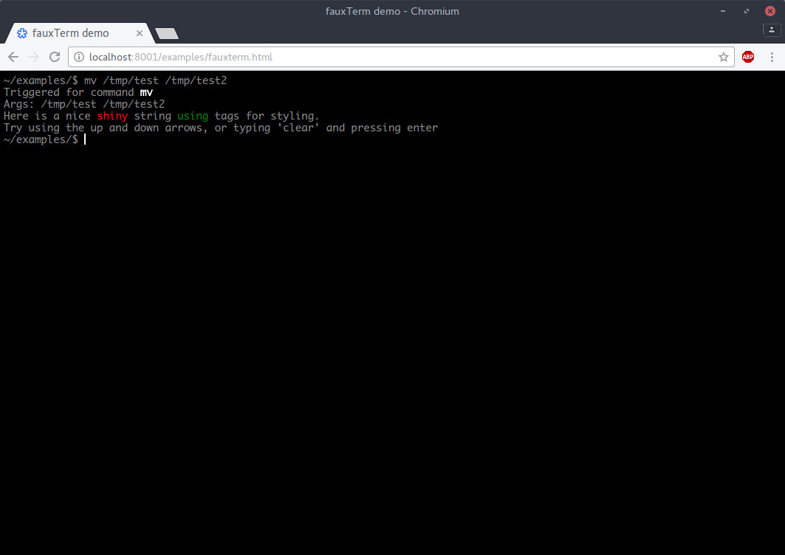

# fauxTerm - A lightweight, faux, terminal-like emulator for the web
Give the false impression of shell integration on the web, without a real shell.



### Demo
See a live demo [here](http://codepen.io/isdampe/pen/bBZzBb), or see the examples/ directory.

## Usage

Step 1. Simple include both fauxTerm.css and fauxTerm.js on your page

```html
<link rel="stylesheet" href="fauxterm.css">
<script src="fauxterm.min.js"></script>
```

Step 2. Initialise a fauxTerm window based on an element

```html
<div id="my-fake-term"></div>
```

```javascript
var myTerm = new fauxTerm({
	el: document.getElementById('my-fake-term'),
	cmd: function(argv, argc) {
		console.log('Received command ' + argv[0]);
		return "Just return a string to have the contents of your command printed!\n";
	}
});
```

## List of available options

```
el: The DOM element to attach to
initialMessage: (string) The initial message to print to the terminal window before user input is accepted
initialLine: (string) Command to pre-fill the "command" line upon load with
cwd: (string) The "pre-input" line that is rendered at the start of each new line, i.e ~/
tags: (array) An array of string "tags" that are automatically replaced with span classes for styling of output
cmd: (function) Callback function to process your fake "commands". Takes two arguments: argv, argc
maxBufferLength: (number) The maximum string length of the fauxTerm window before it gets trimmed
maxCommandHistory: (number) The maximum amount of command history to store
autoFocus: (bool) Whether or not to automatically focus the fauxTerm window upon creation
```

## Built in commands

Currently, the only built in command is "clear", which clears the fauxterm screen buffer.

## Examples
See the [examples](examples/) directory for examples

## Development

```bash
git clone https://github.com/isdampe/fauxterm.git
cd fauxterm
npm install
grunt && grunt watch
```
